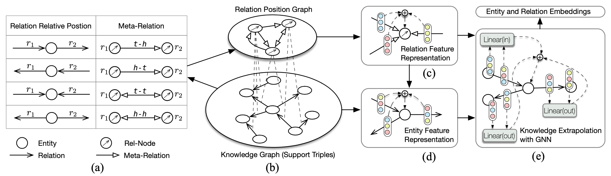

# MaKEr

This repository contains the experimental code for our IJCAI 2022 paper: Meta-Learning Based Knowledge Extrapolation for Knowledge Graphs in the Federated Setting. We study the knowledge extrapolation problem to embed new components (i.e., entities and relations) that come with emerging knowledge graphs (KGs) in the federated setting. In this problem, a model trained on an existing KG needs to embed an emerging KG with unseen entities and relations. 



## Requirements
We use the environment with CUDA based on python 3.8 and following packages:

+ pytorch 1.7.1
+ dgl 0.6.1
+ numpy
+ lmdb
+ argparse

## Dataset

We put datasets uased in our paper in ``./data``, and each dataset is serialized by ``pickle``. You can load the data by:

```python
import pickle
data = pickle.load(open('.data/fb_ext.pkl', 'rb'))
```
Each dataset is formulated as a python ``dict``, like:

```python
data = {
'train': {
	'triples': [[0, 1, 2], [3, 4, 5], ...] # a list of triples in (h, r, t), denoted by corresponding indexes
	'ent2id': {'abc':0, 'def':1, ...} # map entity name from original dataset (e.g., FB15k-237) to the index of above triples
	'rel2id': {'xyz':0, 'ijk':1, ...} # map relation name from original dataset (e.g., FB15k-237) to the index of above triples
}

'valid': {
	'support': # support triples 
	'query': # query triples 
	'ent_map_list': [0, -1, 4, -1, -1, ...] # map entity indexes to train entities, -1 denotes an unseen entitie
	'rel_map_list': [-1, 2, -1, -1, -1, ...] # map relation indexes to train relation, -1 denotes an unseen relation
	'ent2id':
	'rel2id':
}

'test': {
	'support': 
	'query_uent': # query triples only containing unseen entities
	'query_urel': # query triples only containing unseen relations
	'query_uboth': # query triples containing unseen entities and relations
	'ent_map_list': 
	'rel_map_list': 
	'ent2id':
	'rel2id':
}}
```

## Train MaKEr

You can try our code easily by runing the scripts in ``./script``, for example:

```bash
bash ./script/run_fb_ext.sh
```
The training losses and validation results will be printed and saved in the corresponding log file in ``./log``. You can check the log based on the ``task_name`` and the number of the current experiment; for example, for the first run of the task with name ``fb_ext_transe``, you can check the log in ``./log/fb_ext_transe_run0.log``. Furthermore, you can find more detail results in ``./log/fb_ext_transe_50_uent.csv``, which records the results of sampling 50 negative candidate triples for _urel_ query triples.

We put the tensorboard log files in ``./tb_log`` and trained model state dicts in ``./state``.

<!--## Citation
Please cite our paper if you use SimCSE in your work:-->


